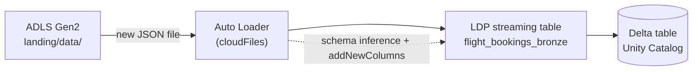
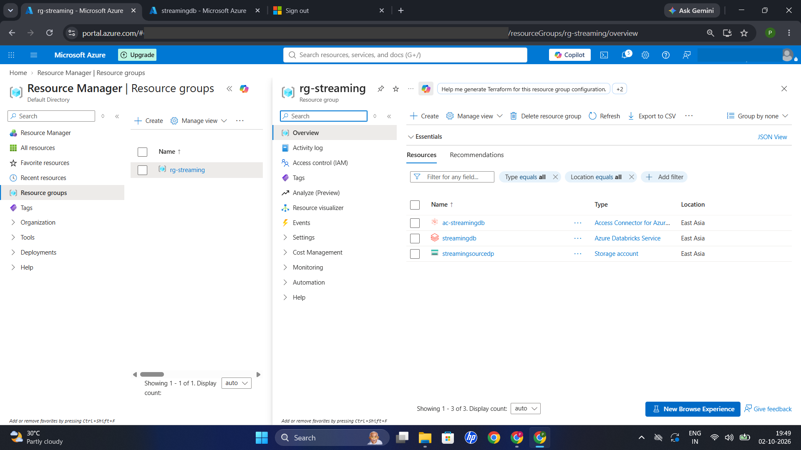
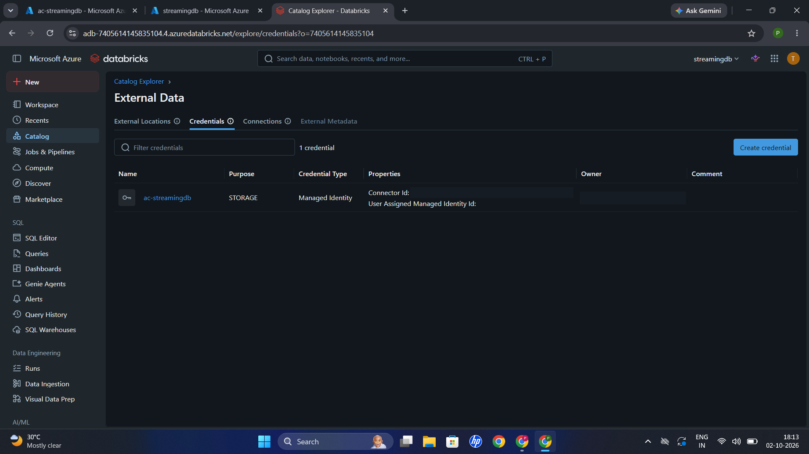
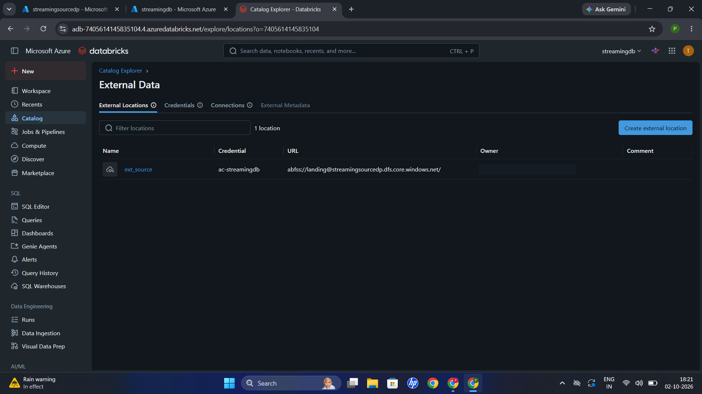
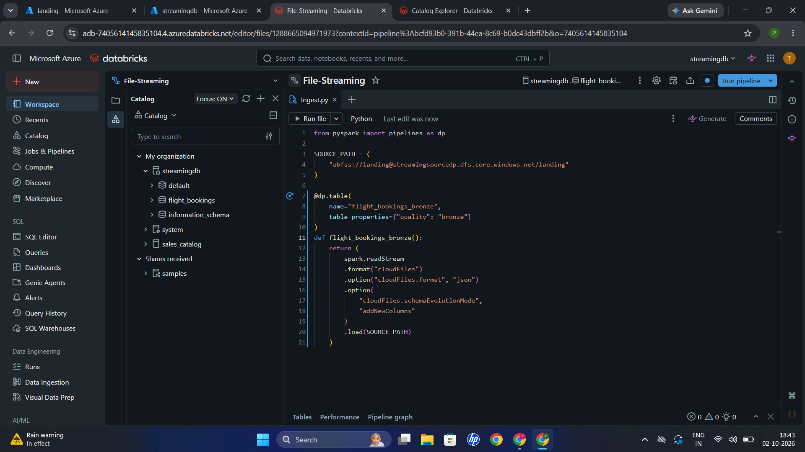
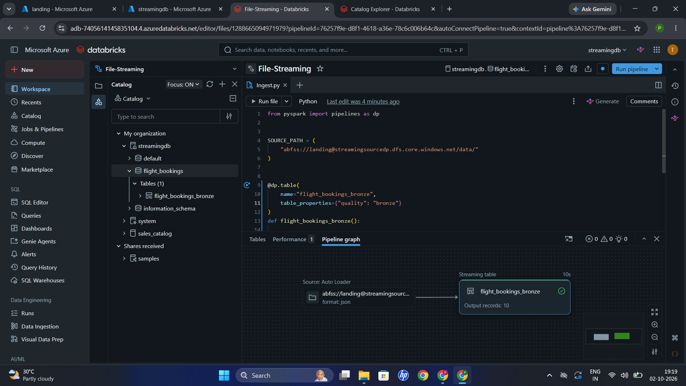
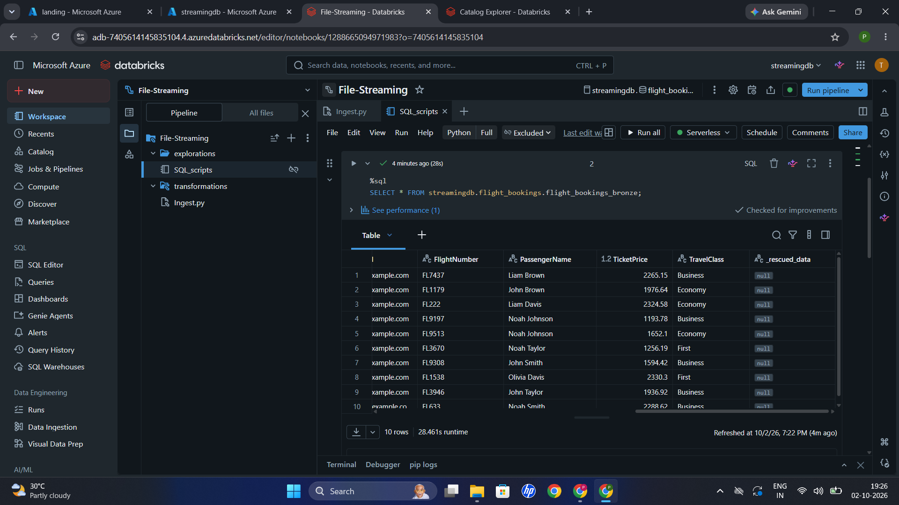
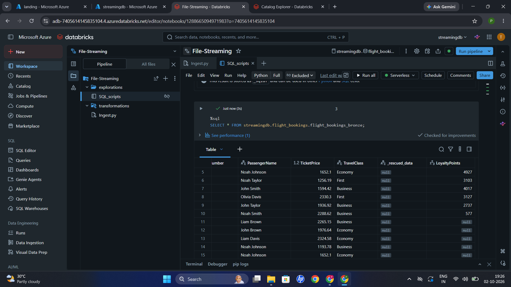
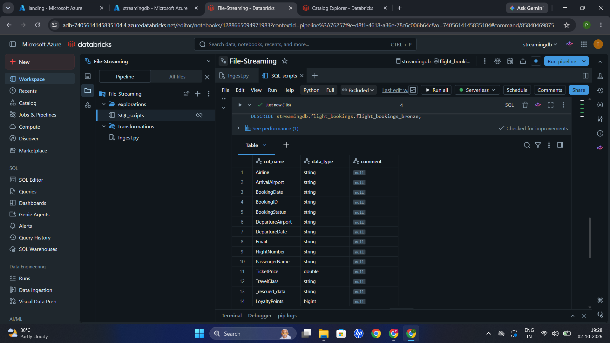

# File Streaming Using LDP

Incremental JSON file ingestion on Azure Databricks using **Auto Loader**, **Spark Structured Streaming** and **Lakeflow Declarative Pipelines (LDP)**, with automatic **schema evolution**.

A pipeline watches an ADLS Gen2 landing folder, loads every new JSON file into a Bronze streaming table, and picks up a new column (`LoyaltyPoints`) the moment it appears in a later file, with no code change and no manual checkpoint handling.

> **Scope:** the project stops at Bronze on purpose. It is about file-based streaming ingestion and schema evolution, not about Silver/Gold modelling (my separate Sales Medallion project covers that).

## Tech stack

Azure Databricks · Lakeflow Declarative Pipelines · Auto Loader (`cloudFiles`) · Spark Structured Streaming · Delta Lake · ADLS Gen2 · Unity Catalog (external location + managed-identity credential)

## Architecture



| Item | Value |
|---|---|
| Resource group | `rg-streaming` (East Asia) |
| Source | ADLS Gen2 container `landing`, folder `data/` |
| Access | Unity Catalog external location `ext_source` via credential `ac-streamingdb` (Access Connector, managed identity) |
| Pipeline | `File-Streaming` (serverless) |
| Target | `streamingdb.flight_bookings.flight_bookings_bronze` |

## Sample data

| File | Rows | Columns | Notes |
|---|---|---|---|
| `flight_bookings_day1.json` | 10 | 12 | Initial schema |
| `flight_bookings_day2.json` | 10 | 13 | Adds `LoyaltyPoints` |

Both files are multiline JSON arrays, so the stream sets `multiLine = true`. The data is synthetic and included in [`data_sample/`](data_sample/README.md). Day 2 repeats the same 10 bookings as Day 1 with `LoyaltyPoints` added, so the Bronze table ends up with 20 rows and each `BookingID` twice (Bronze is append-only; de-duplication is a Silver concern).

## Implementation

The whole pipeline is one table definition in [`transformations/ingest.py`](transformations/ingest.py):

```python
from pyspark import pipelines as dp
from pyspark.sql.functions import current_timestamp

SOURCE_PATH = "abfss://<CONTAINER>@<STORAGE_ACCOUNT>.dfs.core.windows.net/data/"

@dp.table(
    name="flight_bookings_bronze",
    table_properties={"quality": "bronze"},
)
def flight_bookings_bronze():
    return (
        spark.readStream
        .format("cloudFiles")
        .option("cloudFiles.format", "json")
        .option("multiLine", "true")
        .option("cloudFiles.inferColumnTypes", "true")
        .option("cloudFiles.schemaEvolutionMode", "addNewColumns")
        .load(SOURCE_PATH)
        .withColumn("ingested_timestamp", current_timestamp())
    )
```

| Option | Why it is there |
|---|---|
| `spark.readStream` | Streaming source instead of a one-off batch read |
| `format("cloudFiles")` | Enables Auto Loader (incremental file discovery) |
| `multiLine = true` | The sample files are JSON arrays, not newline-delimited JSON |
| `cloudFiles.inferColumnTypes = true` | Infers real types (e.g. `double`, `bigint`) instead of all strings |
| `cloudFiles.schemaEvolutionMode = addNewColumns` | New columns in later files are added to the table schema |
| `ingested_timestamp` | Simple ingestion audit column |

**Checkpointing.** No `checkpointLocation` is set. In a Lakeflow pipeline the platform manages streaming state, checkpoints and the Auto Loader schema location. A standalone Structured Streaming notebook would need an explicit checkpoint path.

## Walkthrough

### 1. Azure resources

A resource group with an Azure Databricks workspace, an ADLS Gen2 storage account for the landing zone, and an Access Connector for Unity Catalog.



### 2. Unity Catalog access

A storage credential backed by the Access Connector's managed identity, and an external location pointing at the `landing` container. No keys or SAS tokens are used.




### 3. Create the pipeline

The pipeline `File-Streaming` with `ingest.py` under `transformations/`, targeting catalog `streamingdb`, schema `flight_bookings`.



### 4. Day 1: first file

With `flight_bookings_day1.json` in the landing folder, the first run reads it through Auto Loader and writes 10 records to the streaming table.




### 5. Day 2: new file, new column

After `flight_bookings_day2.json` is added, the new rows are appended and `LoyaltyPoints` appears. Rows from Day 1 hold `NULL` for it.



### 6. Schema after evolution

`DESCRIBE` shows `LoyaltyPoints` (`bigint`) added to the schema. `_rescued_data` is Auto Loader's standard column for data that does not fit the schema.



## How to reproduce

1. Create the landing folder in ADLS Gen2 and an external location in Unity Catalog.
2. Put `flight_bookings_day1.json` in `data/`.
3. Create a serverless Lakeflow pipeline from `transformations/ingest.py` (catalog `streamingdb`, schema `flight_bookings`) and run it.
4. Upload `flight_bookings_day2.json` to the same folder and run the pipeline again.
5. Validate:

```sql
SELECT * FROM streamingdb.flight_bookings.flight_bookings_bronze;

DESCRIBE streamingdb.flight_bookings.flight_bookings_bronze;

SELECT COUNT(*)              AS total_rows,
       COUNT(LoyaltyPoints)  AS rows_with_loyalty_points
FROM streamingdb.flight_bookings.flight_bookings_bronze;
-- expected after both files: total_rows = 20, rows_with_loyalty_points = 10
```

More detail and troubleshooting: [`docs/runbook.md`](docs/runbook.md). Design notes: [`docs/architecture.md`](docs/architecture.md).

## Design decisions

- **No watermark**: there are no event-time windows or stream-stream joins.
- **No hard-coded schema**: the goal is to show inference plus evolution.
- **No manual checkpoint**: Lakeflow manages state.
- **No ADF / Silver / Gold**: Databricks handles ingestion end to end; transformations are out of scope.

## Repository structure

```text
File-Streaming-Using-LDP/
├── transformations/
│   └── ingest.py
├── docs/
│   ├── architecture.md
│   └── runbook.md
├── resources/
│   └── README.md
├── data_sample/
│   ├── README.md
│   ├── flight_bookings_day1.json
│   └── flight_bookings_day2.json
├── snapshots/            # numbered walkthrough screenshots
├── .gitignore
└── README.md
```

## Skills demonstrated

Auto Loader · Structured Streaming · Lakeflow Declarative Pipelines · schema inference and evolution · multiline JSON ingestion · Delta Lake streaming tables · Unity Catalog external locations and managed-identity access · incremental processing

## Security

No credentials are stored in this repository. The storage path in code is parameterized, and access goes through Unity Catalog with a managed identity. Never commit storage keys, SAS tokens, client secrets or access tokens.
