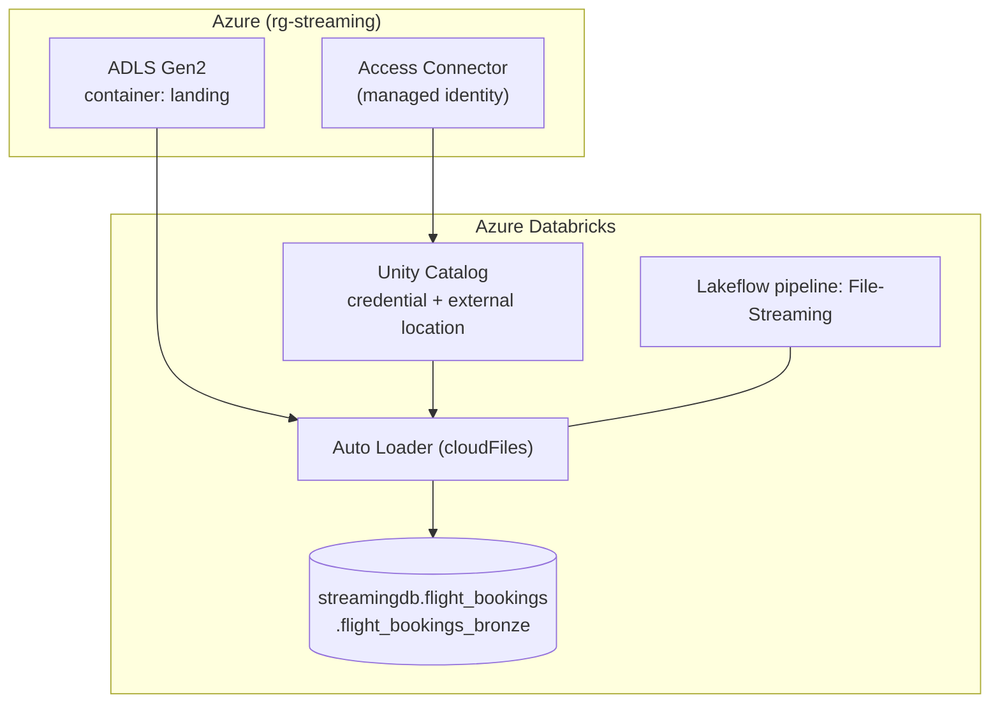

# Architecture

## File-arrival behaviour

| Event | What happens |
|---|---|
| Day 1 file lands | Auto Loader discovers it, infers the schema, 10 rows are written |
| Day 2 file lands | Auto Loader discovers it and finds `LoyaltyPoints`; the schema evolves (`addNewColumns`); 10 more rows are written |

Auto Loader tracks which files it has already processed in pipeline-managed state, so re-running the pipeline does not re-ingest earlier files.

## Target table

`streamingdb.flight_bookings.flight_bookings_bronze`, a Lakeflow streaming table backed by Delta Lake.

## Why Bronze only

The project isolates ingestion mechanics (incremental discovery, schema inference, schema evolution). Silver/Gold modelling is covered in a separate project, which keeps this one easy to explain.
